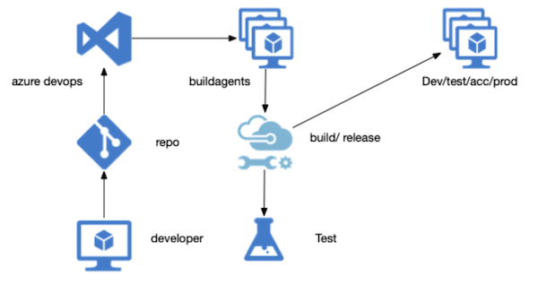
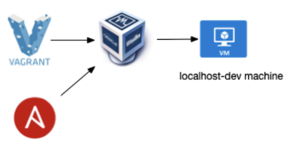
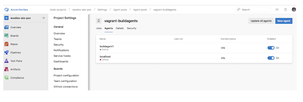

# Azure Packer Demo

This demo shows you how to create an image of an Ansible customized Azure Devops VM. We can use this image to create a 1 Azure VM or even a fleet of VM's which will act as a pool of buildagents.

# Azure Devops Buildagent

The buildagent is part of a pool of agents and is basically a machine that is configured to connect to a devops environment and execute the desired Azure DevOps build and release  tasks.

With Azure Devops you have 2 options for buildagents:
- Configure your own pool of custom build agents
- Use a Hosted solution which is pre configured to run devops tasks, the following Operating Systems are currently supported:
  - Windows
  - Linux (Ubuntu)
  - Max OSX

The buildagent can play an essential role in the Quality Assurance of your release pipeline.

The buildagent in this demo needs to configured to do the following things:
- Needs to run Docker and be able to build and publish images to an ACR
- Needs to be able to connect and deploy to the K8 environment

Optional Quality Assurance measurements could be:
- Connectivity; the configured buildagent is the only vm which is able to access the deployment environments (for eg prod/acc).
- Trusted repos; the buildagent could be configured to use only trusted repositories
- Code scanning; the buildagent can be configured to run certain code quality tasks and vulnarability assesments

## Localhost Buildagent

This demonstrates how to setup a buildagent on your localmachine. Vagrant is repsonsible for packaging the desired machine into a Virtualbox image that can run on any local development machine. The machine is provisioned with an Ansible cookbook. The sourcecode for this can be found [here](https://github.com/chrisvugrinec/azure-packer-demo/tree/master/buildagent/vagrant)
NB: Packer can create Vagrant Images as well, however for using Vagrant for this is way easier.

In order to run this do the following:
- Checkout the sourcecode and cd into the vagrant folder (the folder where the Vagrantfile resides)
- Make sure you have the provisioning/setenv.sh script configured to have the proper values. There is a reference to this script in the Vagrantfile
- The just run the following command: **_vagrant up_**
- You can SSH into this box with the following command: **_vagrant ssh_**

## Azure VM Buildagent

If you are happy with the output of your local ansible cookbook, you can use the same ansible cookbook in order to create a machine on Azure.

With Packer you can create an Azure Image which in this case is provisioned with the same ansible cookbook as the local image.

Based on the Image you can create VM's on Azure that will function as buildagents, the following options are available:
- Azure; use the default tools like: Azure Portal, Azure ARM templates, Azure CLI/Powershell 
- Third party solutions; Like Terraform

The sourcecode for creating a packer image can be found [here](https://github.com/chrisvugrinec/azure-packer-demo/tree/master/buildagent/packer).

The sourcecode for creating an azure vm based on a custom image can be found [here](https://github.com/chrisvugrinec/azure-packer-demo/tree/master/buildagent/terraform).

When the machines are provisioned you should be able to see the buildagents in the agent pool config of your devops project:

